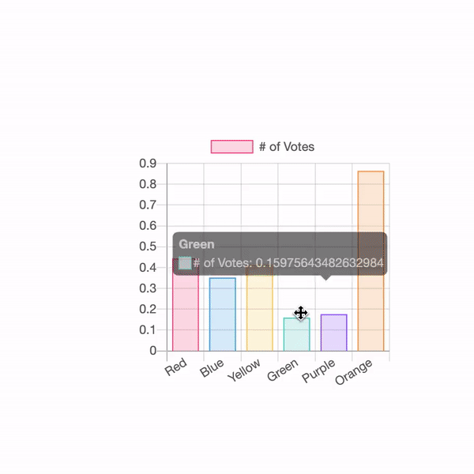

# Chart.js + fabric.js = ❤️

This package allows you to include charts (using Chart.js) into your fabric canvases with support for all features (e.g. events, rotation, scale, etc.).



## Installation

```
yarn add chart-js-fabric
```

# Usage

You can use the regular API from both those great libraries as you would normally. Each fabric.Chart object has an extra "chart" propeprty where you can set your chart.js options (see below).

If using a custom fabric instance, please use the export "install" method.

```js
import { fabric } from 'fabric'
import { install } from 'chart-js-fabric'

install(fabric)
```

Else, simply import the plugin.

```js
import fabric from 'fabric'
import 'chart-js-fabric'

const instance = new fabric.Canvas('#canvas')
instance.add(new fabric.Chart({ width: 100, height: 100, chart: { type: 'bar', data: {...} })
```

To change the charts options, use the normal "set" method. The new options will be merged with the previous one.

```js
const object = new fabric.Chart({
  width: 100,
  height: 100,
  chart: {
    type: 'bar',
    data: {
      labels: ['Red', 'Blue', 'Yellow', 'Green', 'Purple', 'Orange'],
      datasets: [
        {
          label: '# of Votes',
          data: [Math.random(), Math.random()],
          backgroundColor: ['rgba(255, 99, 132, 0.2)', 'rgba(54, 162, 235, 0.2)']
        }
      ]
    }
  }
})

object.set({ chart: { data: [2] })

// object.chart = {
//     type: 'bar',
//     data: {
//       labels: ['Red', 'Blue', 'Yellow', 'Green', 'Purple', 'Orange'],
//       datasets: [
//         {
//           label: '# of Votes',
//           data: [2, Math.random()],
//           backgroundColor: ['rgba(255, 99, 132, 0.2)', 'rgba(54, 162, 235, 0.2)']
//         }
//       ]
//     }
//   }
```

You may add global Chart.js plugins using the utility method "addPlugin".

```js
fabric.util.chart.addPlugin(YourPlugin)
```

You may also change the global default Chart.js options using the utility method "setDefaults". Your new options will be merged with the existing ones.

```js
fabric.util.chart.setDefaults({
  options: {
    onClick() {
      alert('You clicked!')
    }
  }
})
```
